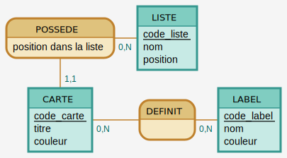

# Modèle de données

## MCD

**Via Mocodo**

```
LISTE: code_liste, nom

POSSEDE, 0N LISTE, 11 CARTE: position dans la liste

CARTE: code_carte, titre
DECORE, 01 CARTE, 0N COULEUR
COULEUR: code_couleur, nom

DEFINIT, 0N CARTE, 0N LABEL

LABEL: code_label, nom, couleur
```



## MLD

**/!\ ou et comment faire apparaître la position dans la liste ?**

- Liste (<ins>id</ins>, nom)
- Carte (<ins>id</ins>, nom, #liste(id), #couleur(id))
- Couleur (<ins>id</ins>, nom, couleur)
- Label (<ins>id</ins>, nom, couleur)
- Carte HAS Label (#carte(id), #label(id))