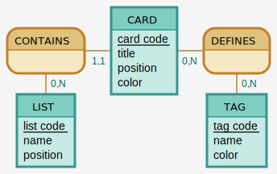

# Modèle de données

## MCD

**Via Mocodo**

```
CONTAINS, 0N LIST, 11 CARD
CARD: card code, title, position, color
DEFINES, 0N TAG, 0N CARD

LIST: list code, name, position
:
TAG: tag code, name, color
```


## MLD

- Liste (<ins>id</ins>, nom, position)
- Carte (<ins>id</ins>, nom, couleur, position)
- Label (<ins>id</ins>, nom, couleur)
- Carte HAS Label (<ins>id</ins>, #carte(id), #label(id))